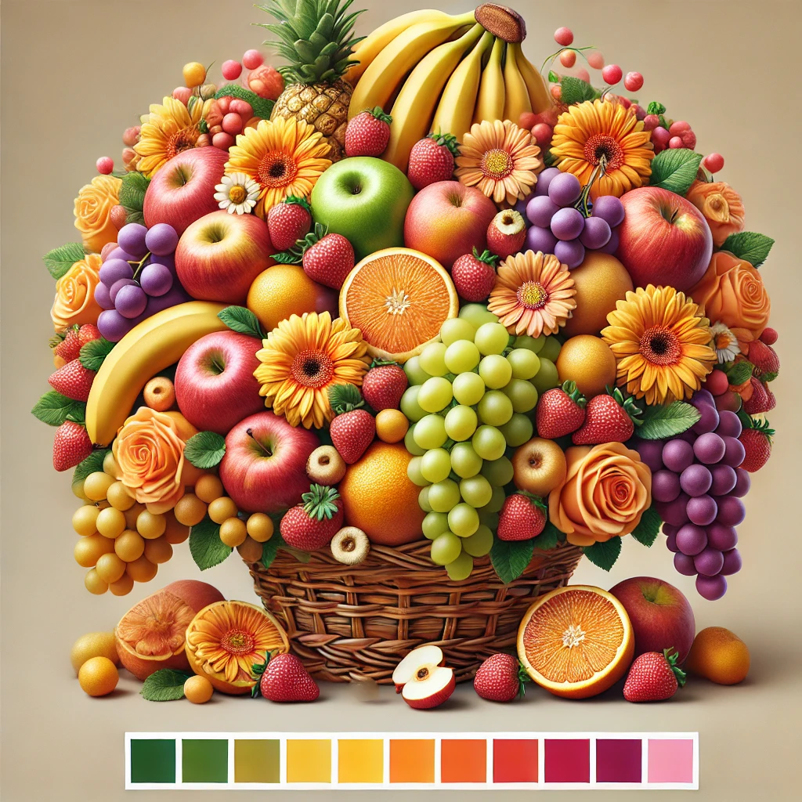

# Img_Compression_Transformation
Image compression and transformation using K-Means and KNN algorithms 

This project shows how KMeans and KNN algorithm can be used to compress and transform images based on the RGB distribution. We use KMeans to cluster the given image into similar clusters of k numbers, the value for which is found using the Elbow method. After finding the ideal k, we use KMeans to group the original RGB values to the closest RGB vale in the k values. This way we compress the image by reducing the pixel distribution. Using the associated k centroids, we try to cluster the pixels in the second image to the k clusters thereby transforming the image.

The elbow graph:

Original image 1:

After compressing to k pixel values:

Original image 2:

After transforming image 2 based on the k centroids: 

